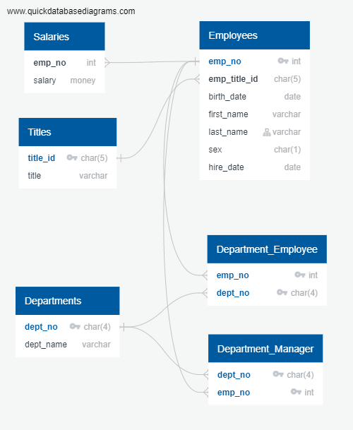

# sql-challenge

Repo for SQL challenge.

It is accepted that the following rules apply to the data:

<ul>
<li>An employee will have only one employee number that uniquely identifies them in the employees table.</li>
<li>An employee will have only one matching; and therefore unique, record with salary data in the salaries table.</li>
<li>An employee can be in multiple departments, but must have one unique record for each department they are in.</li>
<li>An employee who is a manager could be a manager of more than one department, but can only have a unique entry for each department they are manager of.</li>
<li>A department can have more than 1 manager.</li>
<li>The data is historical and no new records will be added beyond importing from the legacy CSV files provided, so support for new, db generated ID's is not required.</li>
</ul>

The following schema was inferred from the CSV files provided (located in the data directory) and is how the db was setup:

